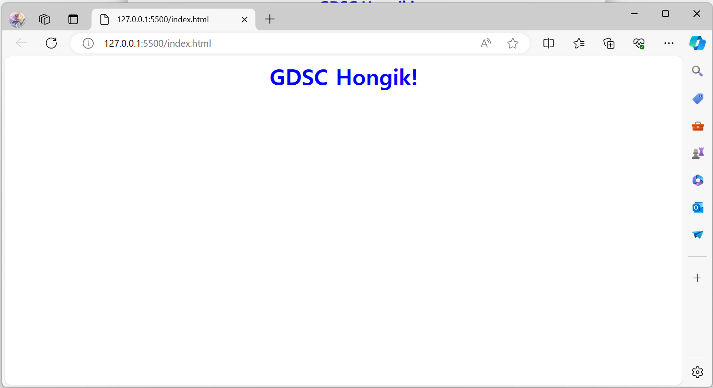

  
1주차에는 주로 웹 개발의 역사에 대해 알아보았다.  
  
웹의 역사는 크게 React의 탄생 전후로 나뉜다.  
현재의 웹 개발 하면 React, node.js, javascript, jQuery정도를 떠올릴 수 있는데,  
웹개발의 발전 과정에서 Facebook을 빼놓고는 이야기할 수 없다.  
  
2004년 Facebook의 탄생 시기에는  
Lambda-APIGateway-MySql-PHP로 이어지는 LAMP스택을 이용했다.  
LAMP스택이란 데이터베이스에서 필요한 데이터를 이용해 웹서버에서 HTML페이지를 모두 만들어 클라이언트에 제공하는 방식이다.  
이러한 방식은 그 특성상 서버에서 페이지를 만들고 클라이언트에 제공하는 것이기 때문에 서버에 부담도 크고, 속도도 느리다.  
  
2010년 jQuery의 등장  
HTML에 클라이언트에서 동작할 수 있는스크립트언어를 동작할 수 있게 하는 라이브러리 javascript를 더욱 쉽게 작성할 수 있도록 사용되었다.  
  
ES5의 등장으로  
브라우저에 정적 정보(웹소켓, 벡터 그래픽 표현(Geogebra 등), 위치정보)를 저장할 수 있는 로컬 스토리지가 등장했다.  
  
브라우저가 점점 더 많은 기능을 제공하기 시작하면서 사용자와 상호작용을 원할히 할 수 있는기능을 요구하기 시작했다.  
자바스크립트는 Document Object Model을 수정해 다양한 웹의 상호작용을 구현했다.  
즉 일부 페이지만을 업데이트(페이스북의 좋아요, 인스타그램의 하트, 유튜브 구독 등)하여 동적으로 서버와 통신할 수 있게 되었다.  
하지만 이러한 기능이 늘어날 수록 javascript환경은 복잡해졌고, 코드는 점점 길어졌다.  
  
이에 facebook은 속도를 우선시하는 웹사이트였고, 이를 위해 서버에서 모든 내용을 렌더링, 로딩 번들의 크기 최소화하고자 많은 노력을 기울였으나, 서버 렌더링이 처리할 수 있는 규모에는 분명한 한계가 존재했다.  
이러한 한계를 해결하기 위해 facebook은 상태의 개념을 활용하여 상태에 따른 ui를 선언적으로 구현하고, jsx문법을 이용해 javascript의 코드 규모를 축소시키는 react를 개발하였다.  
  
react의 초창기에는 관심사 분리 원칙에 어긋난다는 이유로 react에 대한 반발이 거셌다.  
가상DOM을 활용해 DOM을 효율적으로 조작할 수 있다는 점에서 react에 대한 인정이 점차 커져갔다.  
이러한 효율성들 덕에 react에 대한 개발은 더욱 빠르게 이루어졌고, 현재의 웹프론트엔드개발의 점유율은 react가 압도적으로 높다.  
