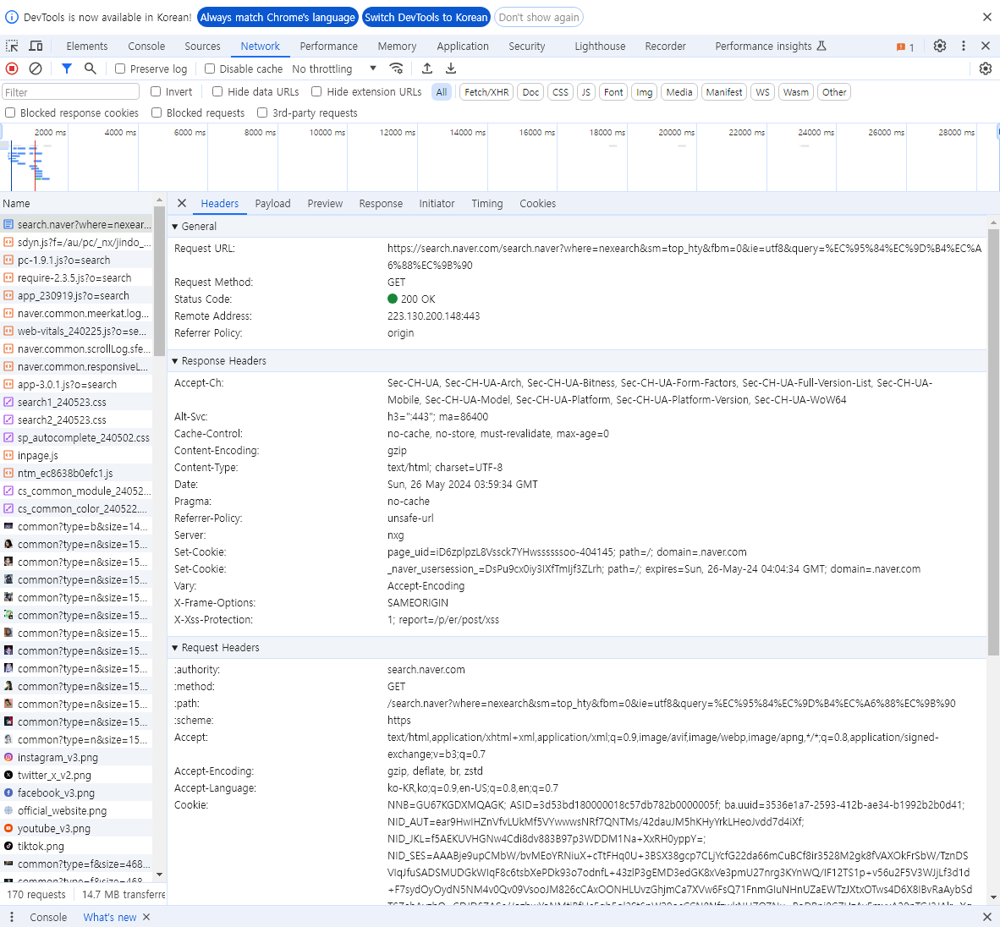
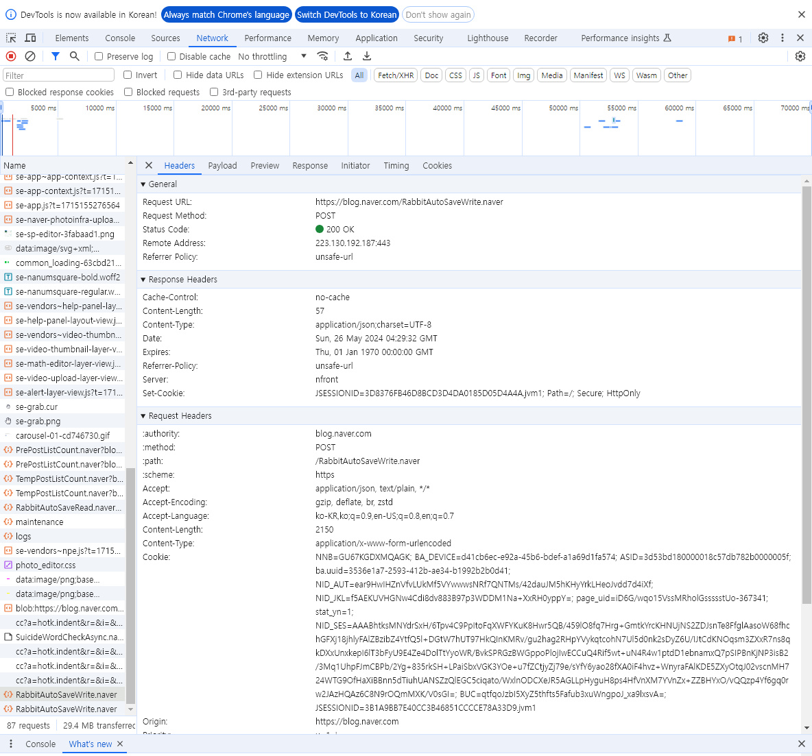
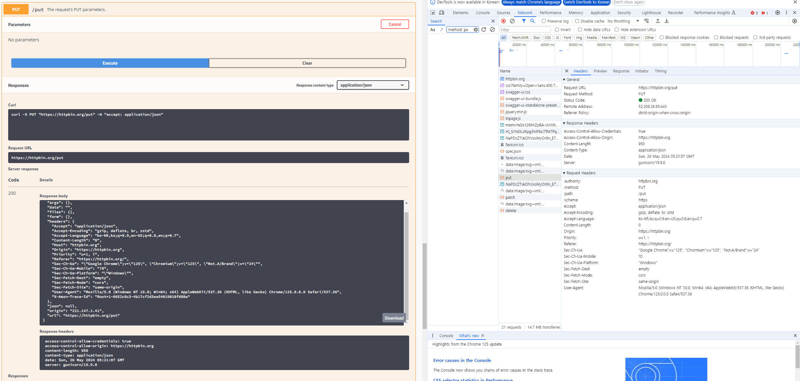
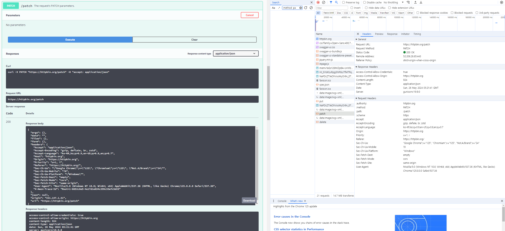
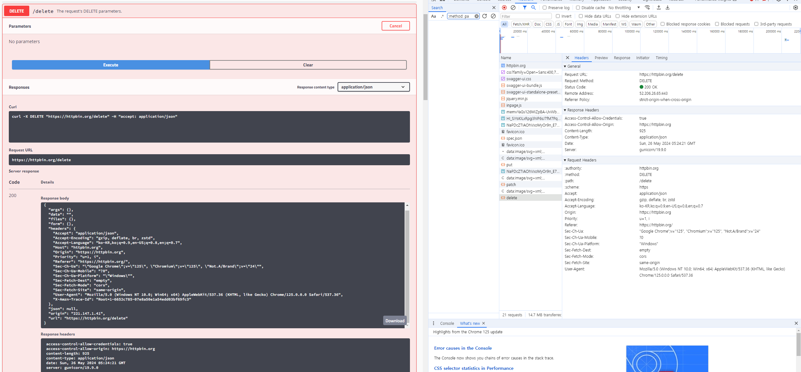

# Goal  
## HTTP의 역사와 현대의 사용방법에 대해 깊이 이해할 수 있다.  
  
초기 http는 get을 이용해 간단하게 페이지를 요청하고 서버에서 반환하는 프로토콜만을 사용했다.  
현대에 이르러서는 HTTP/1.1 이후 아래에 서술한 메서드들을 이용해 훨씬 유연하고 효율적인 동작을 한다.  
HTTP/2.0, HTTP/3.0의 표준화가 완료되었고, 1.1과 2.0은 TCP를 기반으로, 3.0에 이르러서는 UDP를 기반으로 훨씬 빠르고 안정적인 연결을 제공한다.  
  
## 웹에서 사용하고 있는 HTTP 네트워크 통신 메소드와 방법에 익숙해진다.  
## 올바른 API 설계 방법을 여러 가지 사례를 통해 확인할 수 있다.  
  
### GET  

네이버 검색창에 아이즈원을 검색해보았다.  

서버에 정보를 조회하기 위한 기능으로, 서버에서 데이터를 가져오기만 하는 기능이다.  
서버에 전달하고 싶은 데이터는 query로 요청하고, 정보를 조회한다.  
  
### POST  
  
  
네이버 블로그에 글을 게시할 때 자동저장기능으로 인해 서버에 POST요청이 된다.  
이 때의 URL은  
https://blog.naver.com/RabbitAutoSaveWrite.naver  
서버에 새로운 리소스를 등록해주는 역할을 한다.
  
### PUT  
  
httpbin.org라는 웹사이트에서 가상으로 put메서드를 요청하는 기능을 사용해봤다.  
  
덮어쓰기의 개념을 가지고 있는 기능으로, 서버에 있는 리소스를 완전히 지우고 새로 등록하는 효과를 갖는다.  
  
### PATCH  
  
마찬가지로 httpbin.org라는 웹사이트에서 가상으로 patch메서드를 요청하는 기능을 사용해봤다.  
  
put메서드와는 달리 리소스를 완전히 지우는 것이 아닌 리소스 안에서 patch메서드로 요청한 부분("age" or "name" 등)만을 부분적으로 수정한다.  
  
### DELETE  
  
마찬가지로 httpbin.org라는 웹사이트에서 가상으로 delete메서드를 요청하는 기능을 사용해봤다.  
  
리소스를 제거하는 기능이다.  

## HTTP통신의 헤더, 캐시가 무엇인지 그 구성을 예습할 수 있다  
실패...